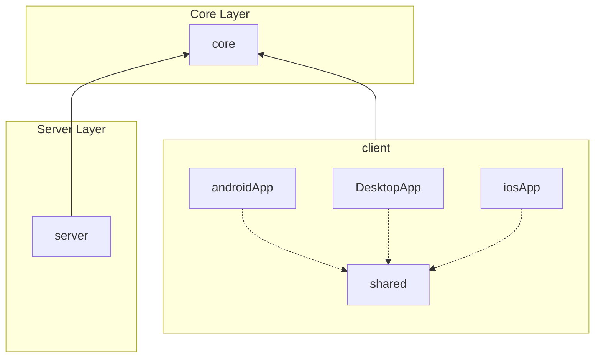

[](https://kotlinlang.org)
[](https://github.com/ahparhizgar/opensplit/actions/workflows/build.yml)


# OpenSplit

**share expenses with your roommate, travel companions, etc...**

# ToC

* [Test Coverage](#test-coverage)
* [Offline-First Architecture](#offline-first-architecture)

## Modules

Core contains shared code used by both server and client.  
Shared code are DTOs and verification logic.



## Build and test

To run two independent instances of the jvm app run:

```shell
./gradlew --offline runA
./gradlew --offline runB
```

## Test Coverage

This project uses **Kover** to measure and report code coverage across the project.

- **Combined Report**: Run `gradle koverHtmlReport` to get an aggregated coverage report for all
  modules.
- **Module-specific Reports**:
    - **Server**: `gradle :server:koverHtmlReport`
    - **Client**: `gradle :app:shared:koverHtmlReport`

## Offline-First Architecture

This project demonstrates a robust **Offline-First** synchronization.

- **Local-Source-of-Truth**: The UI observes Room database `Flows` directly. All user actions (
  creating expenses, joining groups) are written to local storage and a **Sync Outbox** immediately,
  providing zero-latency feedback.
- **Hybrid Sync Strategy**:
    - **Delta Sync (Expenses)**: Uses a shared global version sequence on the backend. Clients pull
      only incremental changes since their last `sync_version`, minimizing payload size.
    - **Full-Refresh (Groups)**: Semi-static metadata is refetched on app launch and navigation to
      ensure consistency, while keeping the local cache for offline navigation.
- **Background Orchestration**: A `SyncManager` handles non-blocking background polling, outbox
  processing, and conflict-free application of server deltas, ensuring the app remains fully
  functional even with intermittent connectivity.

## 📸 Screenshot Testing

This project uses **Roborazzi** to automatically test the UI.

- **One Annotation Does It All**: Just tag the screens with `@ScreenPreview` to automatically test Mobile Dark, and Desktop Light modes. For smaller parts of the UI, use `@ComponentPreview` to test Light and Dark modes.
- **Automatic Discovery**: There is no need to write manual test files for previews! Roborazzi scans the codebase and tests them automatically. To skip a specific preview, simply add `@ExcludeScreenshotTest`.
