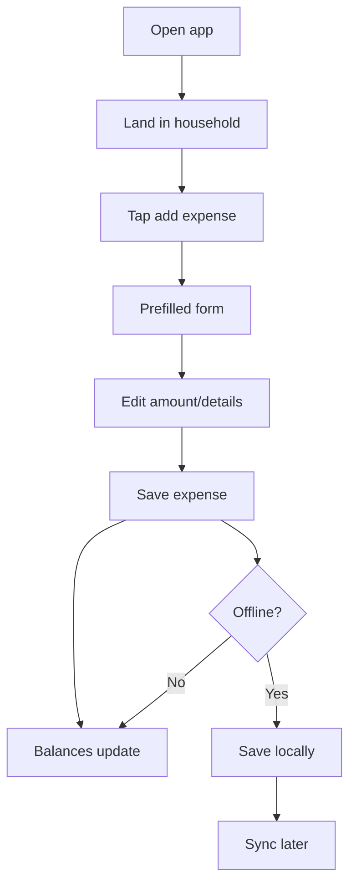
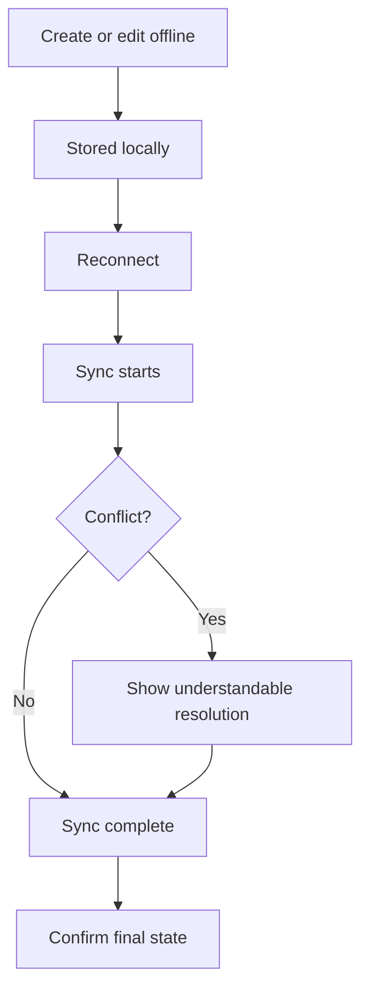
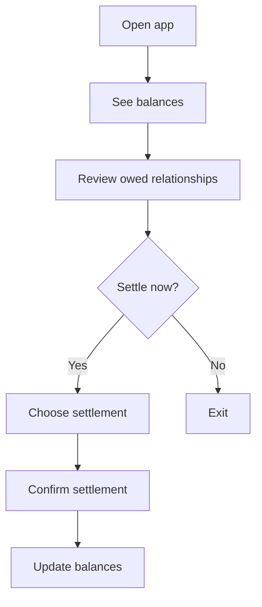

---
stepsCompleted:
  - 1
  - 2
  - 3
  - 4
  - 5
  - 6
  - 7
  - 8
  - 9
  - 10
  - 11
  - 12
  - 13
  - 14
inputDocuments:
  - _bmad-output/planning-artifacts/prd.md
  - _bmad-output/planning-artifacts/product-brief-bmad-test.md
  - _bmad-output/planning-artifacts/product-brief-bmad-test-distillate.md
---

# UX Design Specification OpenSplit

**Author:** Amir
**Date:** 2026-05-03

---

<!-- UX design content will be appended sequentially through collaborative workflow steps -->

## Executive Summary

### Project Vision

OpenSplit should feel like the fastest, clearest way for roommates to record shared costs and understand debts without friction. The UX needs to remove the awkwardness from money tracking by making expense entry, balance review, and settlement feel immediate, simple, and trustworthy.

### Target Users

The primary users are roommates living together in small households. They need a low-friction way to log groceries, utilities, subscriptions, and one-off shared purchases, then see who owes whom without reconstructing the story from chat history or memory.

### Key Design Challenges

- Make expense entry feel effortless enough to use in the moment, not later.
- Keep balance and settlement states unambiguous so users trust the result.
- Support offline creation, editing, and settlement without making sync behavior feel risky or confusing.

### Design Opportunities

- Use strong defaults to minimize taps and decisions during expense entry.
- Make balances visually obvious so users can understand the household at a glance.
- Treat offline resilience and recovery as part of the trust-building experience, not hidden technical behavior.

## Core User Experience

### Defining Experience

OpenSplit’s core experience is fast shared-expense entry followed by immediate, trustworthy balance feedback. The product should make the act of logging a roommate cost feel almost automatic: open the app, confirm the defaults, make only the necessary edits, and save without friction. If that single flow feels effortless, the rest of the product earns trust.

### Platform Strategy

OpenSplit is a mobile-first product with web as a fast companion surface. Mobile should favor touch-friendly, low-step entry in the moment someone pays for something. Web should support quick review, balance checking, and lighter keyboard/mouse-driven edits. Offline support is a core requirement, not a fallback, because users need to capture expenses and settlements wherever they are.

### Effortless Interactions

- Default the household, payer, and equal split whenever possible.
- Minimize required fields and keep the expense form short.
- Update balances immediately after save so users do not need to mentally recalculate.
- Preserve offline actions locally and sync them later without interrupting the user.
- Make settlement and balance review feel as simple as checking a number.

### Critical Success Moments

- The first successful expense save: users should feel the app is faster than chat or a spreadsheet.
- The moment balances update: users should instantly understand who owes whom.
- Offline recovery: users should feel confident that nothing was lost or changed unexpectedly.
- First-time household setup: it must feel lightweight enough to get the group started immediately.

### Experience Principles

- Default to speed.
- Reduce uncertainty.
- Respect the user’s context.
- Preserve trust when things go wrong.
- Make the common path obvious and the rare path recoverable.

## Desired Emotional Response

### Primary Emotional Goals

Users should feel calm, confident, and in control when using OpenSplit. The experience should reduce anxiety around shared money, replace uncertainty with clarity, and leave users feeling that the app is more trustworthy than their current workaround.

### Emotional Journey Mapping

- First discovery: “This seems simple.”
- Core use: “I can do this quickly.”
- After saving: “I trust the result.”
- When something goes wrong: “The app is still on my side.”
- Returning later: “I know exactly where to go.”

### Micro-Emotions

- Confidence over confusion
- Trust over skepticism
- Relief over anxiety
- Satisfaction over frustration
- Belonging over isolation

### Design Implications

- Keep forms short and defaults strong so users feel calm, not burdened.
- Make balances and settlement states visually unambiguous to build trust.
- Use recovery states and sync messaging that reassure rather than alarm.
- Avoid cluttered flows that create doubt at the moment of action.

### Emotional Design Principles

- Remove avoidable stress.
- Make confidence visible.
- Treat errors as recoverable moments.
- Keep the product calm, not clever.
- Reinforce trust at every save and sync.

## UX Pattern Analysis & Inspiration

### Transferable UX Patterns

**Navigation Patterns**
- Group-first context - useful for keeping users anchored in one household.
- Short-path task flow - useful for expense entry and settlement.

**Interaction Patterns**
- Smart defaults - excellent for reducing taps during expense entry.
- Immediate confirmation - addresses trust and confidence after saving.

**Visual Patterns**
- Clear hierarchy for balances - supports calm, confident understanding.
- Lightweight transaction summaries - align with mobile-first speed.

### Anti-Patterns to Avoid

- Overloading the user with finance jargon - creates confusion and intimidation.
- Hiding balance logic behind too many screens - slows down the core loop.
- Making entry feel like accounting - adds friction and anxiety.
- Treating offline/sync states as technical afterthoughts - damages trust.

### Design Inspiration Strategy

**What to Adopt**
- clarity for balances and group context.
- speed and immediate feedback after actions.

**What to Adapt**
- Simplify flows even further for roommate speed.
- Borrow Venmo’s sense of quick completion, but keep the product less social and more practical.

**What to Avoid**
- Social-feed distraction that competes with the core task.
- Dense financial UI that makes the app feel heavy or slow.

## Design System Foundation

### 1.1 Design System Choice

OpenSplit should use a themeable system built on Material 3 patterns, with a lightweight custom visual layer for brand expression and speed-focused screens.

### Rationale for Selection

- It fits a mobile-first app that needs strong accessibility and familiar interaction patterns.
- It speeds delivery without forcing a generic, heavy-looking product.
- It supports cross-platform consistency while leaving room for a calm, trustworthy visual identity.

### Implementation Approach

- Use Material 3 as the component and behavior baseline.
- Customize spacing, color, and motion to make the product feel lighter and more roommate-friendly.
- Favor a small component set optimized for expense entry, balances, and settlement.

### Customization Strategy

- Keep primary actions visually strong and secondary actions quiet.
- Use concise cards, sheets, and lists to support fast scanning.
- Define tokens for color, type, spacing, and elevation so the interface stays consistent across mobile and web.

## Visual Design Foundation

### Color System

OpenSplit should use a calm, trustworthy palette with high contrast and minimal visual noise. The primary direction is a cool, grounded base with a clear accent for action and status.

- Primary: deep teal for trust, clarity, and key actions
- Secondary: warm slate / blue-gray for supporting UI
- Surface: soft off-white and muted neutral panels
- Success: muted green for confirmed balances or completed settlements
- Warning: amber for attention states and sync caution
- Error: restrained red for destructive or failed states

The palette should feel more “reliable utility” than “loud finance app.”

### Typography System

Use a modern, highly readable sans-serif with a calm, practical tone. The typography should feel crisp on mobile and efficient on web.

- Headings: strong, compact, confident
- Body: highly legible, neutral, unforced
- Numeric data: clear tabular treatment where possible for balances and amounts
- Type hierarchy: simple and shallow, so users can scan quickly

The goal is clarity first, personality second.

### Spacing & Layout Foundation

Use an 8px spacing system with a compact but breathable layout. OpenSplit should feel efficient, not crowded.

- Cards and lists should support fast scanning
- Primary actions should sit close to the natural thumb zone on mobile
- Web layouts should preserve a clear information hierarchy without feeling dense
- Separate sections enough to reduce cognitive load, but avoid excessive white space

The layout should make the app feel immediate and easy to trust.

### Accessibility Considerations

- Maintain strong contrast for text, icons, and status colors
- Keep touch targets large enough for mobile use
- Avoid relying on color alone to communicate state
- Preserve readable type sizes for balances and amounts
- Ensure the interface stays understandable in low-light and quick-glance situations

## Design Direction Decision

### Design Directions Explored

We explored a calm, trust-first visual direction built on Material 3 patterns and a lightweight custom layer. The exploration emphasized mobile-first clarity, quick scanning, strong defaults, and low visual noise.

### Chosen Direction

Choose a restrained, utility-focused direction: clean cards, direct hierarchy, soft surfaces, and minimal decorative motion. The product should feel like a dependable roommate tool rather than a social or financial dashboard.

### Design Rationale

- It supports the core loop of fast expense entry and instant balance clarity.
- It aligns with the emotional goal of calm confidence.
- It stays accessible and scalable across mobile and web.

### Implementation Approach

- Use the visual foundation to drive a compact, high-contrast interface.
- Keep navigation shallow and actions obvious.
- Apply the same design language to expense entry, balances, and settlement views.

## User Journey Flows

### Fast Expense Entry

Maya opens OpenSplit, lands in her household, and taps add expense. The form opens with the household and payer already set, an equal split preselected, and the most important fields first. She fills only what changed, saves, and immediately sees the balances update. If she is offline, the app keeps the expense locally and shows that it will sync later.



### Offline Recovery and Sync

Maya records an expense while offline, then later reconnects. The app syncs the saved change, resolves any conflicts in a predictable way, and confirms the final state without making her re-enter data. The goal is reassurance: nothing should feel lost or mysterious.



### Quick Balance Check and Settlement

Maya opens the app later to see who owes whom. She lands on a balance view that highlights the most important totals first, then drills into a settlement action if needed. The flow is designed to make the next step obvious without forcing her to do mental math.



### Journey Patterns

- Default-first entry keeps every flow short.
- Balance feedback follows immediately after action.
- Offline states are persistent but unobtrusive.
- Recovery paths explain outcomes instead of hiding them.

### Flow Optimization Principles

- Minimize steps between intent and result.
- Keep the most common path visible and prefilled.
- Use clear confirmation states at every save.
- Make offline and conflict recovery predictable, not technical.

## Component Strategy

### Design System Components

Material 3 provides the base for buttons, text fields, cards, sheets, tabs, dialogs, lists, navigation, and status indicators. These cover the standard UI building blocks needed for OpenSplit’s core flows.

### Custom Components

### Household Balance Card

**Purpose:** Show the most important household balance at a glance.
**Usage:** Home screen, group summary, and quick review states.
**Anatomy:** Household name, net balance, status label, primary relationship summary.
**States:** Default, loading, empty, positive, negative, warning.
**Variants:** Compact and expanded.
**Accessibility:** Clear text labels, readable amounts, logical reading order.
**Content Guidelines:** Short labels, numeric emphasis, minimal clutter.
**Interaction Behavior:** Tap to open detailed balances.

### Expense Entry Sheet

**Purpose:** Support fast expense creation with strong defaults.
**Usage:** Primary add-expense flow.
**Anatomy:** Header, amount, payer, split, participants, notes, save action.
**States:** Default, validation error, offline, saving.
**Variants:** Mobile sheet, desktop panel.
**Accessibility:** Full keyboard support, explicit labels, focus management.
**Content Guidelines:** Keep fields short and order predictable.
**Interaction Behavior:** Prefill common values and preserve partial input.

### Settlement Summary

**Purpose:** Make settlement actions obvious and trustworthy.
**Usage:** Balance review, settlement confirmation, and history.
**Anatomy:** Who owes whom, amount, action button, confirmation state.
**States:** Default, pending, complete, conflict.
**Variants:** Member-level and household-level.
**Accessibility:** Descriptive action labels and status announcements.
**Content Guidelines:** Use plain language and avoid finance jargon.
**Interaction Behavior:** One clear next action at a time.

### Sync Status Banner

**Purpose:** Reassure users about offline and sync behavior.
**Usage:** When edits are pending or reconnecting.
**Anatomy:** Status icon, message, optional action.
**States:** Synced, pending, reconnecting, conflict.
**Variants:** Banner and inline notice.
**Accessibility:** Announce changes politely and clearly.
**Content Guidelines:** Explain what happened and what will happen next.
**Interaction Behavior:** Non-blocking, informative, recoverable.

### Component Implementation Strategy

- Build custom components on top of Material 3 tokens and states.
- Keep the component set small and reusable across mobile and web.
- Prioritize components that support the expense-to-settlement loop first.

### Implementation Roadmap

**Phase 1 - Core Components:** Household Balance Card, Expense Entry Sheet

**Phase 2 - Supporting Components:** Settlement Summary, Sync Status Banner

**Phase 3 - Enhancement Components:** Settlement history details, richer empty states, conflict explanation views

## UX Consistency Patterns

### Button Hierarchy

Primary buttons should always represent the next meaningful step, especially save, confirm, and settle actions. Secondary actions stay visually quiet and should never compete with the primary task. Destructive actions use clear warning styling and demand deliberate intent.

### Feedback Patterns

Success feedback should be immediate, calm, and specific. Errors should explain what happened and what the user can do next. Warning states should be subtle but persistent, especially for offline or sync conditions. Informational messages should never interrupt the core flow unless action is required.

### Form Patterns

Forms should default to the most likely household, payer, and split. The most important fields appear first, and optional details come later. Validation should happen inline and only when needed. Save should remain available once required fields are complete.

### Navigation Patterns

Navigation should keep users anchored in a single household context. Household summary, balances, expense history, and settlement should stay easy to reach without deep nesting. Mobile navigation should stay shallow and predictable; web can expose more detail without adding complexity.

### Additional Patterns

- Loading states should feel brief and purposeful.
- Empty states should guide the first useful action.
- Conflict states should explain outcomes in plain language.
- Search and filtering should stay lightweight and optional.

## Responsive Design & Accessibility

### Responsive Strategy

OpenSplit should be mobile-first, with layouts that scale up cleanly to tablet and desktop. Mobile prioritizes the active household, quick add-expense entry, and balance visibility. Tablet can show a split-pane view for balances and details. Desktop can support denser review and editing, but should still keep the core task prominent.

### Breakpoint Strategy

- Mobile: 320px-767px
- Tablet: 768px-1023px
- Desktop: 1024px+

Use mobile-first breakpoints and adjust layout density gradually rather than changing the experience shape too abruptly.

### Accessibility Strategy

Target WCAG 2.1 AA. The product should support keyboard navigation, screen readers, strong contrast, and 44x44px minimum touch targets. Avoid color-only meaning, and make status, error, and sync states readable in plain language.

### Testing Strategy

- Test on real phones and tablets for touch and spacing behavior.
- Test on Chrome, Safari, Firefox, and Edge.
- Validate keyboard-only navigation and focus order.
- Run screen reader checks with VoiceOver and NVDA.
- Simulate low contrast and color-blind viewing conditions.

### Implementation Guidelines

- Use relative units for sizing and spacing where possible.
- Build with semantic structure and explicit labels.
- Manage focus carefully for sheets, dialogs, and sync notices.
- Keep responsive changes layout-first, not feature-first.
- Ensure offline and sync messages remain understandable at every size.

## Story 1.4 Desktop View - Household Membership Workspace

### Design Goal

The desktop version of household membership management should turn the current stacked mobile view into a calm workspace that helps users answer three questions quickly: who is in this household, which household am I currently in, and what happens if I switch or leave? The design should keep the product lightweight while using the extra width to reduce scrolling and decision friction.

### User Intent

- Confirm the active household context at a glance.
- Scan current members without opening secondary navigation.
- Switch to another household quickly when the current context is wrong.
- Leave a household safely, with clear confirmation and outcome messaging.

### Scope Alignment

This design stays inside Story 1.4 scope:

- View household members
- Switch households
- Leave a household

It intentionally avoids adding new navigation depth, invitation management, or expense data into this screen.

### Desktop Layout Strategy

Use a two-column workspace inside a centered desktop container.

- Frame target: 1440x1024
- Max content width: 1200px
- Outer margins: 48px to 64px depending on viewport
- Grid: 12 columns, 24px gutters
- Main split: 7 columns for membership context, 5 columns for household actions
- Vertical rhythm: 24px section spacing, 16px card spacing, 8px internal element spacing

### Information Hierarchy

#### Header Bar

The header should anchor context before users touch anything destructive.

- Product label: OpenSplit
- Page title: Household membership
- Active household pill showing the current household name
- Optional secondary text: member count or ownership status
- Top-right utility actions: Refresh, profile/avatar menu

#### Left Column - Current Household Context

This is the primary reading column.

1. **Active household summary card**
   - Household name
   - Current status label: Active household
   - Small metadata row: member count, user role, invite/join context if available

2. **Members card**
   - Section title: Members
   - Intro text: "Everyone who can currently share expenses in this household"
   - Member rows with:
     - Display email or name
     - Owner badge when applicable
     - "You" badge for current user
     - Optional subdued status text for edge cases later, but not required in v1

3. **Safety note**
   - One-line helper copy explaining that changing household only changes context, not data ownership

#### Right Column - Household Actions

This is the action column and should stay visually secondary to the active context.

1. **Switch household card**
   - Section title: Your households
   - Support text: "Change which household you are currently viewing"
   - Household list rows with:
     - Household name
     - Member count
     - Current-state highlight for active household
     - Primary action: Switch (disabled for active household, labeled Current)

2. **Leave household area**
   - Destructive actions should not appear as the primary action in the row
   - Present Leave as a tertiary/destructive action aligned to the row end
   - For the active household, show subtle explanatory copy when leaving changes the visible context

### Desktop Wireframe Logic

```text
------------------------------------------------------------------------------------------------
 OpenSplit                              Household membership                   [Refresh] [Avatar]
                                        [Active: Maple House]
------------------------------------------------------------------------------------------------

  ---------------------------------------------------    --------------------------------------
  Maple House                                          |    Your households                     |
  Active household • 4 members • You are owner         |    Change which household you view    |
                                                        |                                      |
  Members                                               |    [Current] Maple House  4 members   |
  Everyone who can currently share expenses here        |              [Current]    [Leave]     |
                                                        |                                      |
  Maya Chen                    [You] [Owner]            |    Cedar Flat    3 members            |
  sam@example.com                                      |              [Switch]     [Leave]     |
  leo@example.com                                      |                                      |
  nina@example.com                                     |    River House   5 members            |
                                                        |              [Switch]     [Leave]     |
  Switching households changes your current context,    |                                      |
  not your membership in other households.              |                                      |
  ---------------------------------------------------    --------------------------------------

------------------------------------------------------------------------------------------------
```

### Key Interaction Patterns

#### Switching Households

- Switch is a primary action only for non-active households.
- On click, the selected row enters a brief loading state and all switch actions disable until the request completes.
- After success:
  - Active household pill updates
  - Left column summary and members refresh in place
  - Success toast/snackbar: "Switched to Cedar Flat"
  - Keyboard focus moves to the updated left-column heading or the active household pill

#### Leaving a Household

Leaving should always require explicit confirmation, even on desktop.

- Trigger: destructive text button or outlined destructive button in the household row
- Confirmation pattern: modal dialog, not inline expansion, to create clear interruption for a destructive action
- Dialog content:
  - Title: "Leave household?"
  - Body for non-active household: "You will lose access to this household's shared expenses unless someone invites you again."
  - Body for active household with alternatives remaining: "You will leave Maple House and switch to another household you still belong to."
  - Body for last accessible household: "You will leave Maple House and return to household setup."
  - Primary button: Leave household
  - Secondary button: Cancel

After confirmation:

- Show progress in the dialog button state
- On success, close dialog and show contextual confirmation message
- If another household remains, automatically land in the next valid household context
- If no households remain, route to the safe setup/landing state with a success banner

### Empty and Edge States

#### Members Empty State

If the members list is unexpectedly empty:

- Show calm fallback text: "No members found yet"
- Keep the household summary visible so the user still knows where they are

#### Single Household State

If the user belongs to only one household:

- Keep the household list card, but replace multi-row switching affordances with a single current row
- Include helper text: "You only belong to one household right now"
- Leave action remains available but visually separated from switching copy

#### Loading State

- Use skeleton blocks for member rows and household rows
- Keep layout stable while loading to avoid desktop jitter
- Preserve title and active context shell during refresh

#### Error State

- Show inline error banner above the affected card
- Use plain language, e.g. "We couldn't refresh your household list. Try again."
- Keep the last successful data visible whenever possible

### Component-Level Guidance

#### Member Row

- Height: 56px to 64px
- Content aligned left; badges aligned right
- Use subtle separators instead of heavy borders

#### Household Row

- Row height: 72px to 88px
- Name and member count stacked on the left
- Actions aligned right in a horizontal button group
- Active row uses `primaryContainer`; inactive rows use `surfaceVariant`

#### Badges

- `You` badge: secondary emphasis
- `Owner` badge: neutral or accent emphasis, not success green
- Avoid using color alone; include text labels always

### Content Guidelines

- Prefer household names over raw ids in visible desktop UI.
- Use ids only in debug or fallback states.
- Replace technical wording like "context switch" with plain language like "viewing" in user-facing copy.
- Destructive copy should explain the outcome, not just the action.

### Accessibility Requirements for Desktop

- Support full keyboard navigation across household rows and dialog actions.
- Ensure logical tab order: header utilities → left-column summary → members → right-column household actions.
- Provide visible focus indicators on all buttons and actionable rows.
- Announce confirmation and success states to assistive technologies.
- Do not rely on background color alone to identify the current household; include the `Current` label.

### Implementation Notes for Shared Compose UI

- Replace the current narrow `widthIn(max = 420.dp)` active view on large screens with a breakpoint-aware container.
- Preserve the same data model and actions from `HouseholdComponent`; the desktop change is layout and interaction treatment, not a new feature slice.
- The leave flow should gain a confirmation dialog to align the UI with Story 1.4 acceptance criteria.
- Keep existing test tags, and add desktop-safe tags only where they help verify dialog and responsive layout behavior.

### Success Criteria for This View

- Users can identify the active household in under a glance.
- Members and household-switch actions are visible without scrolling on a common laptop viewport.
- Leave is clearly available but visually subordinate to switch.
- Destructive actions feel safe because the confirmation explains the landing outcome.

